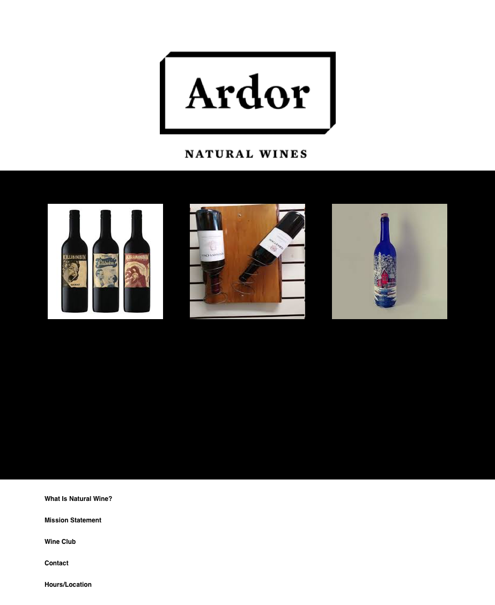
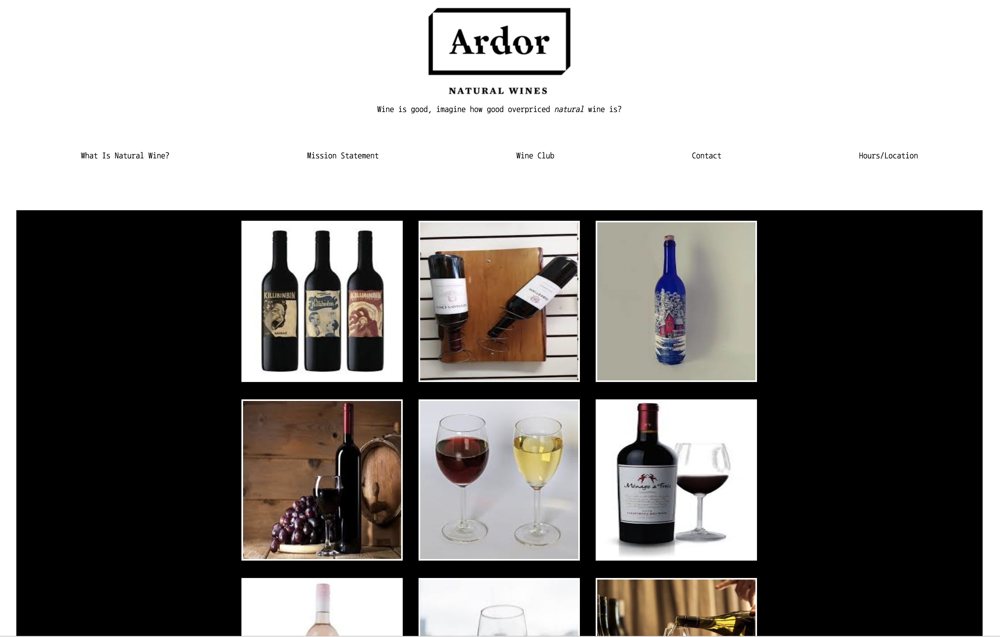

# _Ardor page_

#### _A poorly designed website needing improvements_

#### By _**Nayomi Morita, Nelia Terrazas**_

## Description

_An improved version of a wine website._

## Our Sketch:

## Our Version:

## Their Version:

## Setup

* _Clone this repository_
https://github.com/nayomi-morita/ardor
* _Open index.html in browser_
* _Use chosen code editor to make changes (I used atom)._

## Technologies used
* _HTML_
* _CSS_
* _SASS_

### license

Copyright (c) 2019 **Nayomi Morita, Nelia Terrazas**

This software is licensed under the GPL license.
